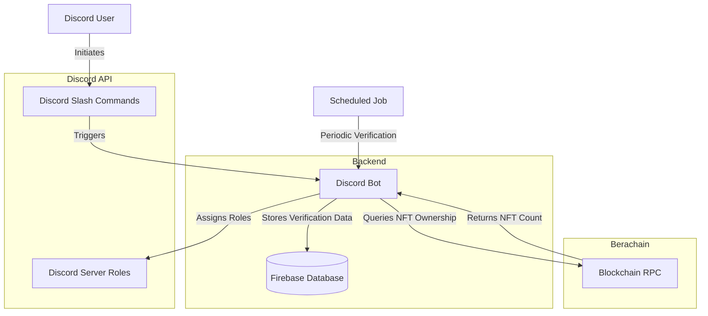

# NFT Verification Bot

A Discord bot for the Mad Bears community that automatically verifies NFT ownership on Berachain and assigns appropriate Discord roles based on holdings. The bot can be configured for any NFT collection on EVM chains. Extending functionality can be achieved with ease. 

## 🚀 Features

- Verify NFT ownership via secure wallet signature verification
- Automatic role assignment based on NFT holdings
- Periodic role updates to reflect buying/selling activity
- Support for multiple tiers of roles based on NFT quantity
- Real-time blockchain validation with Berachain
- User-friendly verification interface via Discord slash commands
- Admin tools for managing verifications and user data

## 📋 Documentation

| Guide | Description |
|-------|-------------|
| [Configuration Guide](./docs/configuration.md) | How to configure the bot settings and roles |
| [Discord Setup](./docs/discord-setup.md) | Creating and configuring your Discord bot |
| [Firebase Setup](./docs/firebase-setup.md) | Setting up the Firebase database |
| [Deployment Guide](./docs/deployment.md) | Deploying the bot to a server |
| [Hosting Options](./docs/hosting.md) | Different hosting options and considerations |
| [Utility Scripts](./docs/scripts.md) | Using the included database and testing scripts |
| [Troubleshooting](./docs/troubleshooting.md) | Common issues and solutions |

## 🔍 Project Overview

The NFT Role Verification Bot connects your Discord server to the blockchain, allowing holders of your NFT collection to receive special roles based on their holdings. The system uses a secure signature-based verification method that proves wallet ownership without requiring private keys.

### System Architecture



## 💻 Installation

1. Clone this repository
```bash
git clone https://github.com/yourusername/discord-nft-verification.git
cd discord-nft-verification
```

2. Install dependencies
```bash
npm install
```

3. Create a `.env` file based on the example
```bash
cp .env.example .env
```

4. Follow the setup guides in the documentation
   - [Discord Bot Setup](./docs/discord-setup.md)
   - [Firebase Setup](./docs/firebase-setup.md)

5. Configure your [settings.json](./docs/configuration.md)

6. Start the bot locally for testing
```bash
node src/index.js
```

## 🔧 Available Commands

| Command | Description |
|---------|-------------|
| `/bmad` | Start the verification process to link your wallet |
| `/status` | Check your current verification status |
| `/help` | Learn about the verification process and security |
| `/verify-all` | (Admin) Trigger verification for all users |

## 🛡️ Security

This bot uses a secure signature verification method that never requires users to share private keys or approve transactions. The verification process:

1. Generates a unique challenge for the user
2. User signs the challenge with their wallet
3. Bot verifies the signature cryptographically
4. Bot checks NFT ownership via blockchain queries

All sensitive information is stored in environment variables, not in the code.

## 🧩 Contributing

Contributions are welcome! Please feel free to submit a Pull Request.

## 📄 License

This project is licensed under the MIT License - see the [LICENSE](LICENSE) file for details.
