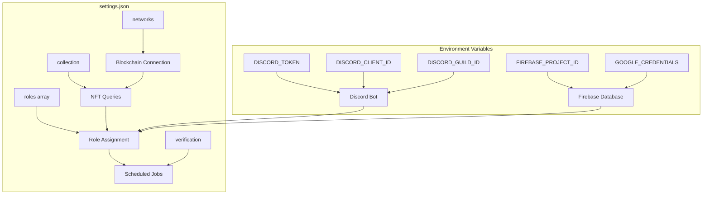

# Configuration Guide

This document explains how to configure the Mad Bears NFT Verification Bot using the settings.json file and environment variables.

## Configuration Overview



### Configuration Components

| Component | Purpose | Location |
|-----------|---------|----------|
| **Environment Variables** | Private API keys and credentials | `.env` file |
| **Role Configuration** | Define NFT tiers and Discord role mappings | `settings.json` roles array |
| **Verification Settings** | Schedule and performance settings for verification | `settings.json` verification object |
| **NFT Collection Settings** | Contract address and chain information | `settings.json` collection object |
| **Network Configuration** | Blockchain connection information | `settings.json` networks object |

## Environment Variables (.env)

Create a `.env` file in the root directory with the following variables:

```
# Discord Bot Configuration
DISCORD_TOKEN=your_bot_token_here
DISCORD_CLIENT_ID=your_client_id_here
DISCORD_GUILD_ID=your_guild_id_for_development

# Firebase Configuration
FIREBASE_PROJECT_ID=your_firebase_project_id
GOOGLE_APPLICATION_CREDENTIALS=./path/to/serviceAccountKey.json
```

### Variable Descriptions

- `DISCORD_TOKEN`: Your Discord bot token from the Discord Developer Portal
- `DISCORD_CLIENT_ID`: Your Discord application client ID
- `DISCORD_GUILD_ID`: The ID of your Discord server (only needed for initial development)
- `FIREBASE_PROJECT_ID`: Your Firebase project ID
- `GOOGLE_APPLICATION_CREDENTIALS`: Path to your Firebase service account JSON file

## Settings.json Configuration

The `config/settings.json` file contains the main configuration for the bot. Here's a breakdown of each section:

### Role Configuration

The `roles` array defines the roles that will be assigned based on the number of NFTs a user holds:

```json
"roles": [
  {
    "name": "Mad Whale",
    "minNFTs": 100,
    "discordRoleId": "1332302531765866537",
    "description": "The ultimate degen. You've risen to the very top, a Mad Kingpin."
  },
  // Other roles...
]
```

Each role has the following properties:
- `name`: Display name of the role
- `minNFTs`: Minimum number of NFTs required to earn this role
- `discordRoleId`: Discord role ID from your server
- `description`: Description of the role shown to users

**Important**: Roles should be ordered from highest to lowest tier in the settings file, though the code will sort them automatically.

### Verification Schedule

Controls the automatic verification job that updates user roles:

```json
"verification": {
  "scheduleInterval": "0 */6 * * *",
  "batchSize": 10, 
  "batchDelay": 2000
}
```

- `scheduleInterval`: Cron expression for how often to run verification (default: every 6 hours)
- `batchSize`: Number of users to process in each batch
- `batchDelay`: Delay in ms between batches to avoid rate limiting

### NFT Collection Configuration

Specifies which NFT collection to check for:

```json
"collection": {
  "contractAddress": "0xFf813D6121142Db3A0545C67E4c047d51061F736",
  "chain": "berachain"
}
```

- `contractAddress`: Ethereum address of your NFT contract
- `chain`: Blockchain network name (e.g., "berachain")

### Network Configuration

Defines the blockchain network connection details:

```json
"networks": {
  "berachain": {
    "chainId": "80085",
    "rpcUrl": "https://rpc.berachain.com",
    "explorerUrl": "https://explorer.berachain.com",
    "name": "Berachain Mainnet"
  }
}
```

For each network:
- `chainId`: Numeric chain ID
- `rpcUrl`: RPC endpoint URL for connecting to the blockchain
- `explorerUrl`: Block explorer URL
- `name`: Human-readable network name

## How to Update Configuration

1. **Discord Role IDs**: 
   - Enable Developer Mode in Discord (Settings > Advanced > Developer Mode)
   - Right-click on a role and select "Copy ID"
   - Update the corresponding `discordRoleId` in settings.json

2. **NFT Contract**: 
   - Update the `contractAddress` with your NFT collection's contract address
   - Make sure the `chain` matches the blockchain where your NFT exists

3. **Verification Schedule**:
   - Modify the `scheduleInterval` using standard cron syntax
   - Common examples:
     - `0 */6 * * *`: Every 6 hours
     - `0 0 * * *`: Once daily at midnight
     - `0 */12 * * *`: Every 12 hours

4. **Performance Tuning**:
   - For large servers, decrease `batchSize` and increase `batchDelay`
   - For small servers, increase `batchSize` and decrease `batchDelay`

## Example Configuration

```json
{
  "roles": [
    {
      "name": "Legendary Holder",
      "minNFTs": 10,
      "discordRoleId": "123456789012345678",
      "description": "Holds 10+ NFTs from the collection."
    },
    {
      "name": "Premium Holder",
      "minNFTs": 3,
      "discordRoleId": "123456789012345679",
      "description": "Holds 3-9 NFTs from the collection."
    },
    {
      "name": "Holder",
      "minNFTs": 1,
      "discordRoleId": "123456789012345680",
      "description": "Holds at least 1 NFT from the collection."
    }
  ],
  "verification": {
    "scheduleInterval": "0 */12 * * *",
    "batchSize": 5,
    "batchDelay": 3000
  },
  "collection": {
    "contractAddress": "0xYourContractAddressHere",
    "chain": "berachain"
  },
  "networks": {
    "berachain": {
      "chainId": "80085",
      "rpcUrl": "https://rpc.berachain.com",
      "explorerUrl": "https://explorer.berachain.com",
      "name": "Berachain Mainnet"
    }
  }
}
```
