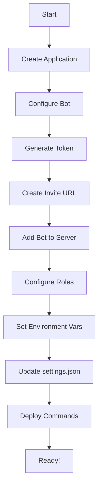

# Discord Bot Setup Guide

This guide walks you through creating and configuring a Discord bot for the Mad Bears NFT Verification system.

## Setup Process Overview



### Important Steps
* **Generate Token**: Save this securely - you won't be able to see it again!
* **Configure Roles**: Role hierarchy is critical to proper bot function

## Role Hierarchy in Discord

```mermaid
graph TD
    admin[Admin/Owner] --> bot[Bot Role]
    bot --> tier1[Highest NFT Role]
    tier1 --> tier2[Mid NFT Role]
    tier2 --> tier3[Basic NFT Role]
    tier3 --> everyone[@everyone]
```

> ⚠️ **CRITICAL**: The Bot role MUST be positioned above all NFT roles it will manage in the Discord server settings!

## Prerequisites

- Discord account with "Manage Server" permissions on your target server
- Access to the [Discord Developer Portal](https://discord.com/developers/applications)

## Step 1: Create a Discord Application

1. Go to the [Discord Developer Portal](https://discord.com/developers/applications)
2. Click "New Application" in the top right
3. Enter a name for your application (e.g., "Mad Bears NFT Verifier")
4. Accept the terms and click "Create"

## Step 2: Configure the Bot

1. In your new application, click on the "Bot" tab in the left sidebar
2. Click "Add Bot" and confirm by clicking "Yes, do it!"
3. Under the "Privileged Gateway Intents" section, enable:
   - SERVER MEMBERS INTENT
   - MESSAGE CONTENT INTENT
4. Under "Bot Permissions", ensure the following are enabled:
   - Manage Roles
   - Send Messages
   - Read Messages/View Channels
   - Use Slash Commands
5. Disable the "Public Bot" option if you don't want others to invite your bot

## Step 3: Get Your Bot Token

1. In the "Bot" tab, click "Reset Token" to generate a new token
2. Copy your bot token and keep it secure
3. **IMPORTANT**: Never share this token or commit it to version control

## Step 4: Create Invite Link

1. Go to the "OAuth2" tab in the left sidebar
2. Select "URL Generator" 
3. In the "Scopes" section, select:
   - `bot`
   - `applications.commands`
4. In the "Bot Permissions" section, select:
   - Manage Roles
   - Send Messages
   - Read Messages/View Channels
5. Copy the generated URL at the bottom of the page

The URL should look like this:
```
https://discord.com/api/oauth2/authorize?client_id=YOUR_CLIENT_ID&permissions=268435456&scope=bot%20applications.commands
```

## Step 5: Invite the Bot to Your Server

1. Paste the invite URL from Step 4 into your browser
2. Select the server where you want to add the bot
3. Authorize the bot with the requested permissions
4. Complete any verification if prompted

## Step 6: Configure Server Roles

Create roles for different NFT holding tiers in your Discord server:

1. Go to Server Settings > Roles
2. Create the following roles (or customize based on your needs):
   - Mad Bear (1+ NFTs)
   - VIB (5+ NFTs)
   - Chaos Bear (10+ NFTs)
   - Alpha Bear (20+ NFTs)
   - Bearzerker (50+ NFTs)
   - Mad Whale (100+ NFTs)
3. **Critical Step**: Position your bot's role ABOVE all the NFT roles in the role hierarchy
4. Note the Role IDs for each role (right-click a role and select "Copy ID")

## Step 7: Configure Environment Variables

Create or edit your `.env` file and add the following variables:

```
DISCORD_TOKEN=your_token_from_step_3
DISCORD_CLIENT_ID=your_application_id_from_step_1
DISCORD_GUILD_ID=your_server_id
```

## Step 8: Enable Third-Party App Access

For the bot to function properly, users need permission to interact with third-party applications in the Discord server.

### Critical Server Settings

1. Go to **Server Settings** → **Integrations**
2. Make sure **Allow members to use Application Commands** is turned **ON**
   - Without this setting, regular members won't be able to use the verification commands

### Security Consideration for Admins

⚠️ **Important Admin Note**: When enabling application commands for members, be selective about which bots you authorize in your server. The setting applies to all bots, so ensure other bots with sensitive commands have proper permission restrictions in place. Consider:

- Reviewing all authorized applications regularly
- Setting command permissions for each bot individually
- Using role-based restrictions for sensitive bot commands

## Step 9: Update Bot Configuration

Update the `config/settings.json` file with your Discord role IDs:

```json
{
  "roles": [
    {
      "name": "Mad Whale",
      "minNFTs": 100,
      "discordRoleId": "YOUR_ROLE_ID_HERE",
      "description": "The ultimate degen."
    },
    // ... other roles
  ]
}
```

## Step 10: Deploy Commands

Run the following command to register slash commands with Discord:

```bash
node src/discord/deploy-command.js
```

Note: Global commands may take up to an hour to propagate across all servers.

## Troubleshooting

### Bot Not Responding to Commands

1. **Commands Not Showing**: Wait up to an hour for global commands to propagate
2. **Permission Issues**: 
   - Check that your bot has proper permissions in the server
   - Ensure your bot has the `applications.commands` scope
3. **Intents Not Enabled**: Verify you've enabled the required intents in the Discord Developer Portal

### Role Assignment Not Working

1. **Role Hierarchy**: The bot's role must be positioned ABOVE any roles it's trying to assign
2. **Invalid Role IDs**: Double-check that the role IDs in your configuration match the actual Discord role IDs
3. **Missing Permissions**: Ensure the bot has the "Manage Roles" permission

### Missing Role Management Permission Error

If users see "The bot doesn't have permission to manage roles" error:
1. The bot might not have the Manage Roles permission
2. The bot's role might be positioned below the roles it's trying to assign in the role hierarchy
3. The server might have 2FA requirement for moderation that the bot can't satisfy

## Discord API Rate Limits

Be aware that Discord has rate limits. If your bot serves multiple large servers:
- Implement retry logic with exponential backoff for API calls
- Batch role updates where possible
- Consider using a queue for high-volume operations
