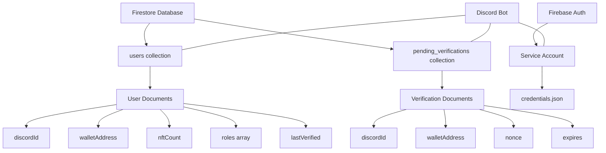

# Firebase Setup Guide

This guide will walk you through setting up Firebase for the Mad Bears NFT Verification Bot.

## Firebase Structure Overview



### Database Collections

#### Users Collection
| Field | Type | Description |
|-------|------|-------------|
| `discordId` | string | Discord user ID |
| `walletAddress` | string | Ethereum wallet address |
| `nftCount` | number | Number of NFTs owned |
| `roles` | array | Discord role IDs assigned |
| `lastVerified` | timestamp | When ownership was last verified |

#### Pending Verifications Collection
| Field | Type | Description |
|-------|------|-------------|
| `discordId` | string | Discord user ID |
| `walletAddress` | string | Ethereum wallet address |
| `nonce` | string | One-time code for verification |
| `expires` | timestamp | When the verification request expires |

## Prerequisites

- Google account
- Firebase project (free tier is sufficient to start)

## Step 1: Create a Firebase Project

1. Go to [Firebase Console](https://console.firebase.google.com/)
2. Click "Add project"
3. Enter a project name (e.g., "nft-discord-bot")
4. Configure Google Analytics (optional)
5. Click "Create project"

## Step 2: Set Up Firestore Database

1. In the Firebase console, go to "Firestore Database"
2. Click "Create database"
3. Choose "Start in production mode"
4. Select a location closest to your Discord bot server
5. Click "Enable"

## Step 3: Set Up Authentication (Service Account)

1. In the Firebase console, go to Project Settings → Service accounts
2. Click "Generate new private key"
3. Save the JSON file securely - you'll need it for the bot configuration
4. Never commit this file to version control

## Step 4: Configure Firestore Rules

1. Go to "Firestore Database" → "Rules" 
2. Replace the default rules with:

```
rules_version = '2';
service cloud.firestore {
  match /databases/{database}/documents {
    match /users/{userId} {
      allow read, write: if false; // Only allow access via Firebase Admin SDK
    }
    match /pending_verifications/{verificationId} {
      allow read, write: if false; // Only allow access via Firebase Admin SDK
    }
  }
}
```

3. Click "Publish"

## Step 5: Configure Environment Variables

Add your Firebase credentials to your `.env` file:

```
FIREBASE_PROJECT_ID=your-project-id
GOOGLE_APPLICATION_CREDENTIALS=./path/to/serviceAccountKey.json
```

## Step 6: Initialize Firebase Structure

Run the provided setup script to initialize your Firebase collections:

```bash
node scripts/firebase-setup.js
```

This script will:
- Verify your Firebase credentials
- Create necessary collections (users, pending_verifications)
- Set up indexes for efficient queries

## Database Structure

The bot uses the following collections:

### users
Stores user verification data including:
- Discord user ID
- Wallet address
- NFT count
- Role information
- Verification timestamp

### pending_verifications
Temporary storage for verification requests:
- Nonce values for signature verification
- Wallet addresses
- Expiration timestamps

## Utilities and Maintenance

The script directory contains additional utilities to manage your Firebase database:

```bash
node scripts/firebase-utils.js [command]
```

Available commands:
- `stats` - View database statistics (user counts, NFT distribution)
- `export` - Export user data to a JSON file
- `clean` - Clean up expired verification requests
- `test` - Test database connection
- `reset-user [discordId]` - Reset a specific user's verification

## Troubleshooting

### Authentication Errors

If you encounter authentication errors:
1. Check that your service account JSON file path is correct
2. Ensure the file hasn't been corrupted
3. Verify your project ID matches what's in the Firebase console

### Permissions Errors

If you encounter permissions errors:
1. Make sure you're using the Firebase Admin SDK in your code
2. Check that your service account has sufficient permissions
3. Verify you're not trying to access Firestore directly from client code

### Performance Issues

If queries are slow:
1. Add appropriate indexes for your frequent queries
2. Check your data structure to ensure efficient access patterns
3. Monitor your usage in the Firebase console
