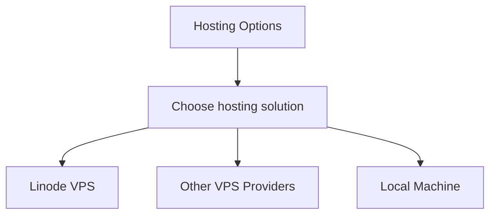

# Hosting Guide

This guide explains deployment options for the Discord NFT Verification bot.

## Hosting Options



### Deployment Methods

| Hosting Option | Use Case | Notes |
|----------------|----------|-------|
| **Linode VPS** | Production | Recommended, detailed instructions provided |
| **Other VPS** | Production | Similar steps apply (AWS, Digital Ocean, etc.) |
| **Local Machine** | Testing & Small Production | Suitable for testing and smaller communities |

## Linode VPS Setup

Detailed instructions for Linode deployment, which we've tested extensively:

1. **Create a Linode account** at [linode.com](https://www.linode.com/)
2. **Provision a Linode** (Ubuntu 20.04+, Shared CPU 1GB plan recommended)
3. **Perform basic server setup**:
   - System updates
   - Optional: Create a user account (can use root for simplicity)
4. **Transfer your code** to the server
5. **Install Node.js and dependencies**
6. **Configure environment variables**
7. **Set up PM2** for process management

For step-by-step details with Linode, refer to our [Deployment Guide](./deployment.md).

## Setting Up PM2 Process Manager

PM2 keeps your bot running continuously and handles crashes:

1. **Install PM2** globally:
   ```bash
   npm install -g pm2
   ```

2. **Start the bot with PM2**:
   ```bash
   pm2 start src/index.js --name nft-bot
   ```

3. **Set up PM2 to start on system boot**:
   ```bash
   pm2 startup
   # Follow the instructions output by the above command
   pm2 save
   ```

4. **Monitor the bot**:
   ```bash
   pm2 status     # Check if the bot is running
   pm2 logs nft-bot  # View logs
   pm2 monit      # Monitor CPU and memory usage
   ```

## Updating Your Bot

Procedure for updating your deployed bot:

1. **Stop the bot**:
   ```bash
   pm2 stop nft-bot
   ```

2. **Pull the latest changes**:
   ```bash
   git pull
   ```

3. **Install any new dependencies**:
   ```bash
   npm install
   ```

4. **Restart the bot**:
   ```bash
   pm2 restart nft-bot
   ```

## Local Development and Testing

For development and testing:

```bash
# Start the bot in development mode
npm run dev
```

This uses nodemon for auto-reloading during development.

## Monitoring Production Deployments

- Set up health checks (e.g., UptimeRobot)
- Regularly check logs: `pm2 logs nft-bot`
- Configure Discord webhook notifications for critical events

## Data Backup

Backup your configuration and credentials:

```bash
# Example backup script
mkdir -p ~/backups
cp .env ~/backups/bot-env-$(date +%Y%m%d).backup
cp config/settings.json ~/backups/settings-$(date +%Y%m%d).json
```

## Troubleshooting

### Bot Goes Offline

1. Check server status
2. Verify process: `pm2 status`
3. Check logs: `pm2 logs nft-bot`
4. Check Discord API status

### Performance Issues

1. Check for memory leaks
2. Review CPU/memory usage: `pm2 monit`
3. Consider upgrading server resources
4. Optimize batch processing settings
