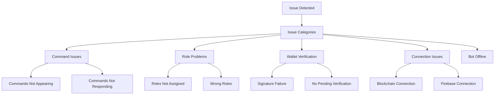

# Troubleshooting Guide

This guide helps you diagnose and fix common issues with the Mad Bears NFT Verification Bot.

## Troubleshooting Guide



### Common Issues by Category

| Issue Type | Problem | First Step | Common Solution |
|------------|---------|------------|----------------|
| **Commands** | Not appearing | Check registration | Run deploy-commands.js |
| **Commands** | Not responding | Check permissions | Verify bot intents & permissions |
| **Roles** | Not assigned | ⚠️ Check role hierarchy | **Move bot role above NFT roles** |
| **Roles** | Wrong roles | Check configuration | Verify minNFTs in settings |
| **Wallet** | Signature failure | Verify process | Check wallet address format |
| **Wallet** | Missing verification | Check flow | Restart verification process |
| **Connection** | Blockchain issues | Check RPC | Test URLs or use alternatives |
| **Connection** | Firebase issues | Check credentials | Verify credential path & permissions |
| **General** | Bot offline | Check hosting | Use a process manager like PM2 |

## Discord Command Issues

### Commands Not Appearing

**Symptoms:** Slash commands (/bmad, /status) don't appear in Discord.

**Solutions:**
1. **Wait for propagation:**
   - Global commands can take up to an hour to appear on all servers
   - Try running `node src/discord/deploy-command.js` again

2. **Check application permissions:**
   - Ensure your bot has the `applications.commands` scope in its OAuth URL:
   ```
   https://discord.com/api/oauth2/authorize?client_id=YOUR_CLIENT_ID&permissions=268435456&scope=bot%20applications.commands
   ```
   - Re-invite the bot with the correct URL if needed

3. **Check Discord rate limits:**
   - If you've deployed commands multiple times in quick succession, you might hit rate limits
   - Wait 10-15 minutes before trying again

### Commands Visible But Not Working For Some Users

**Symptoms:** Some users can see but can't use the commands, or commands don't respond.

**Solutions:**
1. **Re-invite the bot with proper permissions:**
   - Use the URL format with both `bot` and `applications.commands` scopes:
   ```
   https://discord.com/api/oauth2/authorize?client_id=YOUR_CLIENT_ID&permissions=268435456&scope=bot%20applications.commands
   ```

2. **Check bot intents:**
   - Ensure you've enabled the proper intents in `client.js`:
   ```javascript
   const client = new Client({ 
     intents: [
       GatewayIntentBits.Guilds, 
       GatewayIntentBits.GuildMembers,
       GatewayIntentBits.GuildMessages
     ]
   });
   ```
   - Also ensure these are enabled in the Discord Developer Portal

3. **Check command registration:**
   - Make sure commands are registered globally, not just for a specific guild
   - In `deploy-command.js`, use the `.body` method that doesn't include guild ID:
   ```javascript
   const data = await rest.put(
     Routes.applicationCommands(clientId),
     { body: commands },
   );
   ```

4. **Check command permissions:**
   - If you've set up command permissions, ensure they're configured correctly
   - By default, slash commands should be available to all users

## Role Assignment Problems

### Roles Not Being Assigned

**Symptoms:** Verification completes successfully, but users don't receive roles.

**Solutions:**
1. **Check role hierarchy:**
   - **CRITICAL:** The bot's role must be ABOVE all roles it's trying to assign in the server settings
   - Go to Server Settings > Roles and drag the bot's role above all NFT-related roles

2. **Verify role IDs:**
   - Ensure role IDs in `settings.json` match exactly with your Discord server roles
   - Use Developer Mode (Settings > Advanced) to copy role IDs

3. **Check bot permissions:**
   - The bot needs "Manage Roles" permission

4. **Check logs:**
   - Look for permission errors in the console output
   - Add additional logging to trace the role assignment process

### Users Receiving Incorrect Roles

**Symptoms:** Users receive roles but not the ones matching their NFT count.

**Solutions:**
1. **Check role tiers in settings:**
   - Verify the `minNFTs` thresholds in `settings.json`
   ```json
   "roles": [
     {
       "name": "Mad Whale",
       "minNFTs": 100,
       "discordRoleId": "1332302531765866537"
     },
     // other roles...
   ]
   ```

2. **Check NFT counting logic:**
   - Verify the blockchain query is correctly counting NFTs
   - Test with known wallet addresses and NFT counts

3. **Force a re-verification:**
   - Run the verification for all users: `/verify-all` (admin only)
   - Or have the specific user run `/bmad` again

## Wallet Verification Issues

### "Signature Verification Failed"

**Symptoms:** Users get "Signature Verification Failed" error during wallet verification.

**Solutions:**
1. **Wrong signature format:**
   - Ensure users are copying the ENTIRE signature including the "0x" prefix
   - Make sure they're not modifying the message before signing

2. **Wallet mismatch:**
   - The wallet address they entered must match the one they're signing with
   - Check for typos in the wallet address

3. **Expired verification:**
   - Verification requests expire after 10 minutes
   - Have the user restart the process

### "No Pending Verification Found"

**Symptoms:** Users get "No Pending Verification Found" when submitting signatures.

**Solutions:**
1. **Verification timeout:**
   - Verification requests expire after 10 minutes
   - Have the user restart the verification process

2. **Database issues:**
   - Check Firebase connection and permissions
   - Verify the `pending_verifications` collection is being properly managed

## Blockchain Connection Issues

### "Cannot Connect to Blockchain"

**Symptoms:** Error messages related to blockchain connection failures.

**Solutions:**
1. **Check RPC URL:**
   - Verify the RPC URL in `settings.json` is correct and accessible:
   ```json
   "networks": {
     "berachain": {
       "rpcUrl": "https://rpc.berachain.com"
     }
   }
   ```

2. **RPC rate limiting:**
   - You might be hitting RPC provider rate limits
   - Consider using a paid RPC service or multiple fallback RPCs

3. **Network issues:**
   - Check if your hosting provider is blocking outgoing connections
   - Try a different RPC endpoint

## Firebase Issues

### Authentication Errors

**Symptoms:** Errors related to Firebase authentication or "Permission denied" errors.

**Solutions:**
1. **Check credentials file:**
   - Verify the path in `GOOGLE_APPLICATION_CREDENTIALS` points to a valid JSON file
   - Make sure the service account has correct permissions

2. **Project configuration:**
   - Verify the `FIREBASE_PROJECT_ID` matches your Firebase project
   - Check Firebase console for any account issues or suspensions

3. **Rule configuration:**
   - Ensure Firestore rules are properly set up

## Bot Status and Reliability

### Bot Goes Offline Frequently

**Symptoms:** Bot appears offline or stops responding periodically.

**Solutions:**
1. **Check hosting:**
   - Ensure your hosting solution is reliable and has enough resources
   - For VPS/servers, use a process manager like PM2 to auto-restart on failure

2. **Memory leaks:**
   - Check for memory usage growing over time
   - Restart the bot periodically as a preventative measure

3. **Error handling:**
   - Improve error handling to prevent crashes
   - Add global error handlers for unhandled exceptions

### Command Timeout Errors

**Symptoms:** Users report that commands take too long and time out.

**Solutions:**
1. **Optimize blockchain queries:**
   - Use more efficient methods to query the blockchain
   - Cache results where appropriate

2. **Batch processing:**
   - Adjust batch settings in `settings.json` for verification process
   ```json
   "verification": {
     "batchSize": 10,
     "batchDelay": 2000
   }
   ```

3. **Use ephemeral messages:**
   - Make sure commands that take time use ephemeral responses that can be updated

## Advanced Diagnostics

### Enabling Verbose Logging

For more detailed debugging:

1. Add enhanced logging in `client.js`:
```javascript
client.on('debug', console.log);
```

2. Set environment variable for Node.js debugging:
```
NODE_DEBUG=discord* npm run dev
```

### Testing Bot Components

To test specific components:

1. **Test database connection:**
```bash
node scripts/firebase-utils.js test
```

2. **Test blockchain connection:**
Create a simple test script:
```javascript
// test-blockchain.js
const { ethers } = require('ethers');
const settings = require('./config/settings.json');

async function testConnection() {
  const network = settings.networks[settings.collection.chain];
  const provider = new ethers.providers.JsonRpcProvider(network.rpcUrl);
  
  try {
    const blockNumber = await provider.getBlockNumber();
    console.log(`Connected successfully! Current block: ${blockNumber}`);
  } catch (error) {
    console.error('Connection failed:', error);
  }
}

testConnection();
```

Run with:
```bash
node test-blockchain.js
```

## Getting Additional Help

If you can't resolve an issue using this guide:

1. Check the Discord.js documentation: https://discord.js.org/
2. Post in the Discord.js support server: https://discord.gg/djs
3. For Firebase issues, consult the Firebase documentation: https://firebase.google.com/docs
4. For complex issues, consider posting with detailed logs and steps to reproduce on GitHub issues
